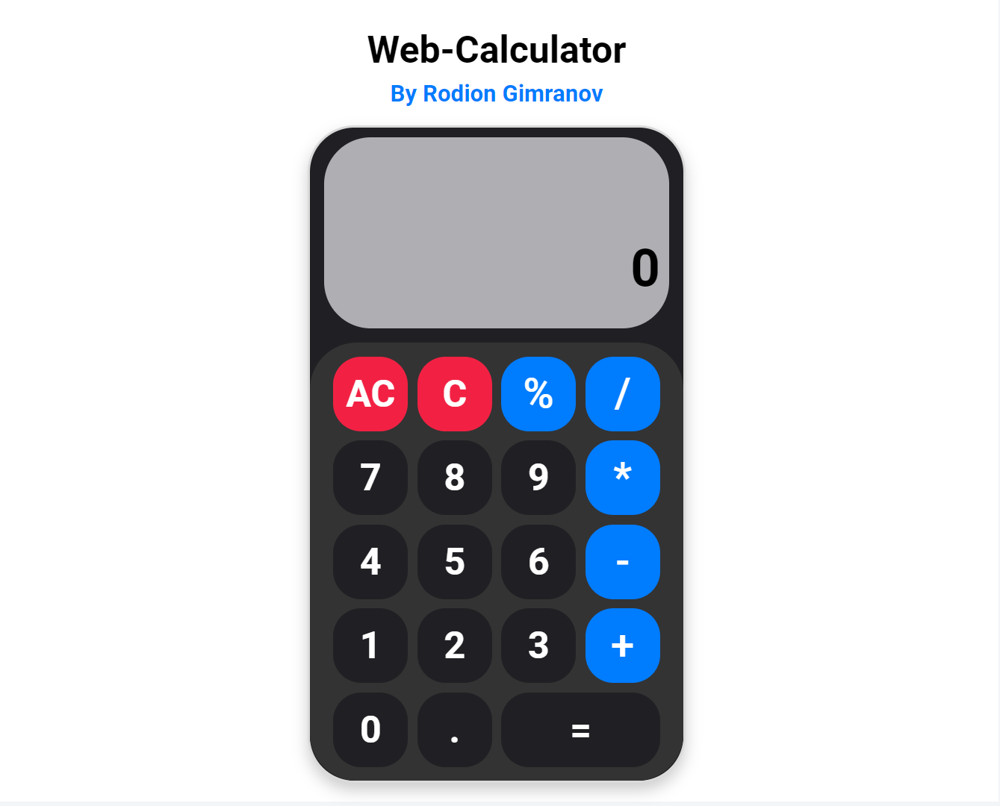

# Веб-Калькулятор

## 📜 Описание

Данный какулятор сосоит из простейших математических операций.

## 🛠 Технологии

- **HTML**
  - main.html - (Основной файл HTML)

- **CSS**
  - normalize.css - (Сброс стилей CSS)
  - style.css - (Стили сайта)

- **JS**
  - calc.js (код для работы калькулятора)

- **img**
  - Логотип и фото калькулятора

## 📞 Контакты

Если у вас есть вопросы или вы хотите обсудить возможные проекты, не стесняйтесь обращаться:

- 📱Telegram: [Rodion Gimranov](https://t.me/RodionGimranov)
- 🌐 LinkedIn: [Rodion Gimranov](https://www.linkedin.com/in/rodiongimranov/)
- 🐱 GitHub: [rodion-gimranov](https://github.com/RodionGimranov)

### Пожалуйста, не забудьте оценить этот проект ⭐

Если вам понравился этот проект или если вы нашли что-то полезное, пожалуйста, поставьте звёздочку ⭐ на этом GitHub репозитории. Спасибо!